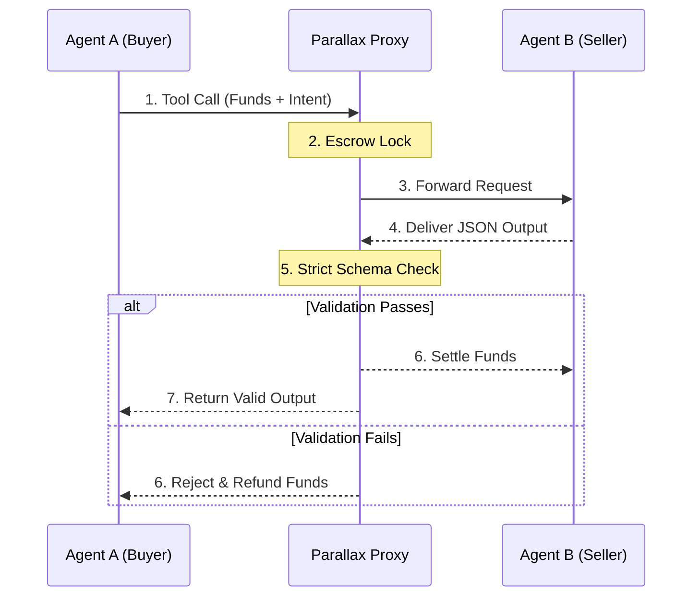

<div align="center">
  <h1>⟁ Parallax Protocol</h1>
  <p><b>The deterministic escrow & verification middleware for AI agent swarms.</b></p>
  
  [](https://opensource.org/licenses/Apache-2.0)
  []()
  []()
  []()
</div>

## The "Why": Decoupled Value & State
In the emerging world of agent-to-agent transactions, AI models currently trade data and API calls with zero financial guarantees. If Agent A (a buyer) pays Agent B (a seller) for an API call, and Agent B returns a hallucinated or broken JSON blob, Agent A just burned company funds on useless tokens. 

**Parallax solves this.** It acts as an MCP-compatible clearinghouse that sits between agents, escrowing funds and computationally validating the work against a strict SLA before releasing the payment.

## Architecture



## Key Features

- **Deterministic Validation:** Automatically blocks hallucinated JSON keys, missing fields, or broken types before they hit your core system.
- **SOC2 Immutable Audit Logs:** Every transaction is tracked via an OpenTelemetry pipeline and SHA-256 hashed, creating an append-only, tamper-proof ledger.
- **Human-in-the-Loop (HITL) Thresholds:** High-value or high-risk transactions are automatically halted and placed in a `PENDING_HUMAN_APPROVAL` queue in the Enterprise Command Center.
- **W3C DID Agent Identity:** Agents act as autonomous cryptographic entities using Ed25519 Decentralized Identifiers (DIDs), enabling secure, Zero-Trust cross-enterprise networking.

## Quickstart

Boot the entire Enterprise stack (FastAPI Backend + Next.js Command Center) locally in 60 seconds:

```yaml
# docker-compose.yml snippet
services:
  parallax-proxy:
    image: ghcr.io/parallax-protocol/parallax-proxy:latest
    ports:
      - "8000:8000"
    environment:
      - PARALLAX_MODE=enterprise
```

```bash
docker compose -f docker-compose.enterprise.yml up -d --build
```
*Then open **[http://localhost:3000/enterprise](http://localhost:3000/enterprise)** to access the Admin Command Center.*

## MCP Integration

Parallax acts as an MCP (Model Context Protocol) middleware. You don't need to rewrite your agent logic. Simply wrap your existing CrewAI or LangChain agent with the Parallax MCP client to auto-escrow and auto-validate its downstream calls.

```python
from parallax_sdk import ParallaxMCPClient
from pydantic import BaseModel

# Connect to the Parallax Proxy
mcp = ParallaxMCPClient("http://localhost:8000")

class FinancialReport(BaseModel):
    revenue: float
    is_profitable: bool

# Wrap your existing agent's tool call
@mcp.escrow_tool(schema=FinancialReport, max_payment=50.0)
def generate_competitor_report(company_name: str):
    # Your agent's logic (e.g., CrewAI, LangChain, or raw LLM call)
    return {"revenue": 1000000.50, "is_profitable": True}

# Parallax intercepts the call, locks $50.00 in escrow, 
# and only settles if the return dict strictly matches FinancialReport.
report = generate_competitor_report("Acme Corp")
```

## Roadmap

- **Phase 1 (Deterministic):** Core Escrow & Pydantic Schema Validation ✅
- **Phase 2 (Semantic LLM Judge):** Entropy-based qualitative validation ✅
- **Phase 3 (Crypto Settlement):** L2 Stablecoin clearing ✅
- **Phase 4 (Enterprise Command):** HITL Thresholds & Next.js Admin Dashboard ✅
- **Phase 5 (Cross-Enterprise Network):** Ed25519 DIDs and Atomic Handshakes ✅

## Contributing & License
Read [CONTRIBUTING.md](CONTRIBUTING.md) to get involved.
Parallax is released under the [Apache-2.0 License](LICENSE).

<div align="center">
  <i>Receipts for every cent.</i>
</div>