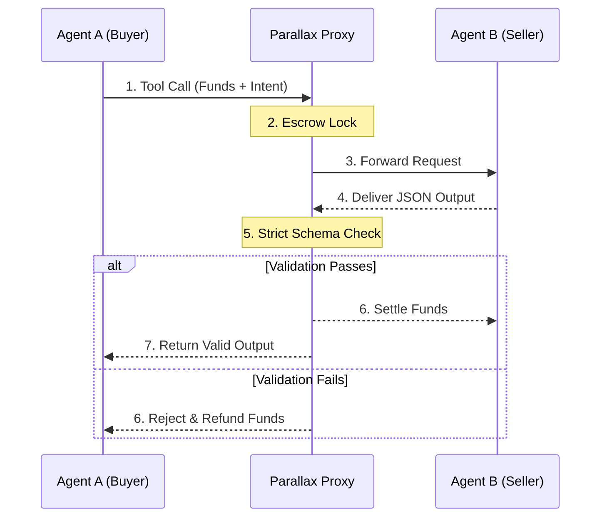

<div align="center">
<h1> Parallax Protocol</h1>
  <p><b>The Passport for AI Agents — Plan, Execute, Settle with Cryptographic Guarantees</b></p>
  
  [](https://opensource.org/licenses/Apache-2.0)
  []()
  []()
  []()
  []()
  []()
</div>

---

## 🎯 The Problem: AI Agents Trade Without Trust

In the emerging economy of autonomous agents, AI models negotiate, purchase data, and invoke APIs with **zero financial guarantees**. 

**The Nightmare Scenario:**
- Agent A (Buyer) pays Agent B (Seller) $50 for market research
- Agent B returns hallucinated JSON with missing fields
- Agent A burns budget on useless tokens
- No recourse. No receipt. No trust.

**This is the Wild West of machine-to-machine commerce.**

---

## ✨ The Solution: Parallax as Your Agent's Passport

**Parallax Protocol** is the first deterministic escrow & verification middleware designed for AI agent swarms. We provide the cryptographic infrastructure that allows agents to:

- **Plan** complex multi-step workflows with guaranteed execution budgets
- **Execute** tool calls across untrusted counterparties with escrowed funds
- **Settle** payments only when work passes mathematical validation
- **Build Reputation** through verifiable transaction receipts

Think of Parallax as your agent's **passport, bank account, and court system** rolled into one MCP-compatible layer.

---

## 🔌 Connect ANY Agent in Minutes

Parallax is **agent-agnostic** — integrate with your favorite AI platforms instantly:

| Agent/Platform | Integration | Setup Time | Status |
|----------------|-------------|------------|--------|
| **Claude Desktop** | MCP Server | 2 min | ✅ Ready |
| **ChatGPT / GPTs** | Custom Actions | 5 min | ✅ Ready |
| **Google Gemini** | Function Calling | 5 min | ✅ Ready |
| **Microsoft AutoGen** | Tool Wrapper | 3 min | ✅ Ready |
| **CrewAI** | Custom Decorator | 3 min | ✅ Ready |
| **LangChain** | Tool Integration | 3 min | ✅ Ready |
| **LlamaIndex** | Query Engine | 4 min | ✅ Ready |
| **Custom Agents** | REST API + SDK | 10 min | ✅ Ready |

👉 **[See Complete Integration Guide →](docs/connectors/README.md)**

---

## 🏗️ Architecture: The Verification Cascade



---

## 🚀 Core Capabilities: Build Custom Agent Frameworks

Parallax isn't just a validator — it's the foundation for building **production-grade autonomous agent systems**:

### 🔐 Trustless Execution Layer
- **Deterministic Validation Engine**: Block hallucinated keys, missing fields, or broken types before they corrupt your system
- **Semantic LLM Judge**: Entropy-based qualitative validation for fuzzy requirements (Phase 2 ✅)
- **Human-in-the-Loop (HITL)**: High-value transactions auto-route to human approval queues in Enterprise mode

### 💰 Financial Infrastructure
- **Micro-Escrow Contracts**: Lock funds per tool call with millisecond precision
- **HTTP 402 Payment Required**: Native support for machine-to-machine payment signaling
- **L2 Stablecoin Rails**: Coming soon — settle in USDC on Base/Optimism

### 🛡️ Security & Compliance
- **SOC2 Immutable Audit Logs**: Every transaction hashed via SHA-256, streamed through OpenTelemetry
- **W3C DID Agent Identity**: Ed25519 Decentralized Identifiers enable Zero-Trust cross-enterprise networking
- **Cryptographic Receipts**: Verifiable proof of work for every settled transaction

### 🧩 Developer Experience
- **MCP-Native Integration**: Wrap CrewAI, LangChain, or custom agents without rewriting logic
- **Custom DSL for SLAs**: DriftGuard assertions for chainable, composable validation rules
- **Real-Time WebSocket Feeds**: Live transaction monitoring for dashboards and alerting systems

---

## 🎯 Use Cases: What Can You Build?

| Use Case | Description | Parallax Feature |
|----------|-------------|------------------|
| **Multi-Agent Research Swarms** | Coordinate 10+ agents gathering market data with budget caps | Escrow + Schema Validation |
| **Autonomous Procurement** | Agents negotiate prices, validate invoices, settle payments | HTTP 402 + HITL Thresholds |
| **Cross-Enterprise Data Markets** | Buy/sell proprietary datasets between companies | W3C DIDs + Trust Scores |
| **Compliance Auditing** | Generate immutable receipts for regulatory reporting | SOC2 Logs + SHA-256 Hashing |
| **Dynamic Pricing Engines** | Real-time price validation with penalty clauses for bad data | Micro-SLA + Semantic Judge |

---

## 🚀 Quickstart: Deploy Your Agent Passport

Boot the entire Enterprise stack (FastAPI Backend + Next.js Command Center) locally in 60 seconds:

```yaml
# docker-compose.yml snippet
services:
  parallax-proxy:
    image: ghcr.io/parallax-protocol/parallax-proxy:latest
    ports:
      - "8000:8000"
    environment:
      - PARALLAX_MODE=enterprise
```

```bash
docker compose -f docker-compose.enterprise.yml up -d --build
```

*Then open **[http://localhost:3000/enterprise](http://localhost:3000/enterprise)** to access the Admin Command Center.*

---

## 💻 MCP Integration: Wrap Your Agents in Minutes

Parallax acts as an MCP (Model Context Protocol) middleware. You don't need to rewrite your agent logic. Simply wrap your existing CrewAI, LangChain, or custom agent with the Parallax MCP client to auto-escrow and auto-validate its downstream calls.

### Basic Example

```python
from parallax_sdk import ParallaxMCPClient
from pydantic import BaseModel

# Connect to the Parallax Proxy
mcp = ParallaxMCPClient("http://localhost:8000")

class FinancialReport(BaseModel):
    revenue: float
    is_profitable: bool
    currency: str = "USD"

# Wrap your existing agent's tool call
@mcp.escrow_tool(schema=FinancialReport, max_payment=50.0)
def generate_competitor_report(company_name: str):
    # Your agent's logic (e.g., CrewAI, LangChain, or raw LLM call)
    return {"revenue": 1000000.50, "is_profitable": True, "currency": "USD"}

# Parallax intercepts the call, locks $50.00 in escrow, 
# and only settles if the return dict strictly matches FinancialReport.
report = generate_competitor_report("Acme Corp")
```

### Advanced: Custom Agent Framework Integration

Build your own agent orchestration layer on top of Parallax:

```python
from parallax_sdk import ParallaxAgent, EscrowPolicy, ValidationCascade

# Define a custom validation cascade for your domain
class ProcurementPolicy(EscrowPolicy):
    max_amount: float = 500.0
    require_human_approval_above: float = 200.0
    allowed_categories = ["software", "hardware", "consulting"]
    
# Create a specialized agent with built-in budget controls
procurement_agent = ParallaxAgent(
    name="ProcurementBot",
    policy=ProcurementPolicy(),
    validation_cascade=ValidationCascade(
        stage1_schema_check=True,
        stage2_exact_match=False,
        stage3_semantic_judge=True
    )
)

# Execute multi-step workflow with automatic escrow management
async def run_procurement_workflow():
    async with procurement_agent.budget_session(total_budget=1000.0) as session:
        # Each tool call auto-escrows funds
        vendor_quotes = await session.call_tool("fetch_vendor_quotes", category="software")
        best_vendor = await session.call_tool("evaluate_vendors", quotes=vendor_quotes)
        
        # High-value purchase triggers HITL approval
        purchase_order = await session.call_tool(
            "create_purchase_order", 
            vendor=best_vendor,
            amount=350.0  # Above threshold → requires human approval
        )
        
        return purchase_order
```

### Custom DSL for SLA Definition

Define composable validation rules with DriftGuard:

```python
from parallax_sdk.dsl import DriftGuard, field, rule

# Build a custom schema validator for your industry
price_validator = DriftGuard.define("PriceValidation") \
    .field("price", type=float, min_value=0.0, required=True) \
    .field("currency", type=str, enum=["USD", "EUR", "GBP"]) \
    .rule("price_matches_market", lambda data: data["price"] < market_avg * 1.2) \
    .rule("no_hallucinated_keys", lambda data: set(data.keys()).issubset(expected_keys)) \
    .on_violation("reject_and_refund") \
    .on_success("settle_immediately")

# Apply to any agent tool
@parallax.protect(with_schema=price_validator)
def fetch_market_price(ticker: str):
    return llm_query(f"Get price for {ticker}")
```

---

## 📍 Roadmap: The Path to Autonomous Commerce

| Phase | Feature | Status | Impact |
|-------|---------|--------|--------|
| **Phase 1** | Core Escrow & Pydantic Schema Validation | ✅ Complete | Foundation for trustless transactions |
| **Phase 2** | Semantic LLM Judge (Entropy-based) | ✅ Complete | Handle fuzzy, qualitative requirements |
| **Phase 3** | L2 Stablecoin Clearing (USDC on Base/Optimism) | 🔄 In Progress | Native crypto settlement rails |
| **Phase 4** | Enterprise Command Center + HITL | ✅ Complete | Human oversight for high-stakes decisions |
| **Phase 5** | Cross-Enterprise DID Network | ✅ Complete | Zero-trust agent identity across organizations |
| **Phase 6** | Agent Reputation Marketplace | 📅 Q2 2025 | Trade with agents based on verified track records |
| **Phase 7** | Multi-Chain Settlement | 📅 Q3 2025 | Settle in any token, any chain |
| **Phase 8** | Autonomous Legal Contracts | 📅 Q4 2025 | Smart contracts that enforce SLAs on-chain |

---

## 🤝 Contributing & License

Read [CONTRIBUTING.md](CONTRIBUTING.md) to get involved.  
Parallax is released under the [Apache-2.0 License](LICENSE).

---

<div align="center">
  <h3>🎫 Your Agent's Passport to the Machine Economy</h3>
  <p><i>Receipts for every cent. Trust for every transaction.</i></p>
  <p>
    <a href="https://github.com/parallax-protocol/parallax-lite/issues">Report Bug</a> • 
    <a href="https://github.com/parallax-protocol/parallax-lite/discussions">Request Feature</a> • 
    <a href="https://discord.gg/parallax">Join Discord</a>
  </p>
</div>
